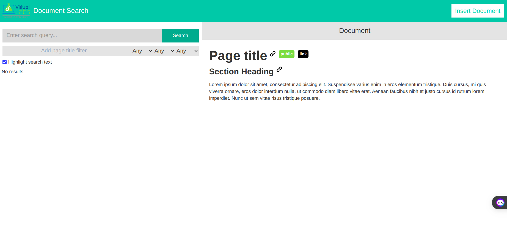
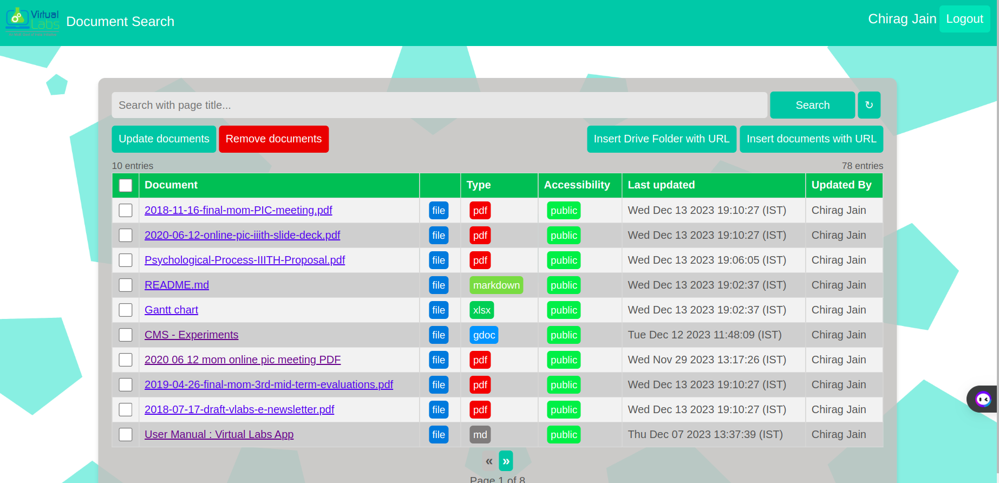

# User Document - Virtual Labs Document Search Tool

## Welcome!

Welcome to the Virtual Labs Document Search Tool! This user guide is designed to help you navigate through the tool effortlessly and make the most out of its powerful document search capabilities. Whether you are a document searcher looking for specific information or a document manager responsible for adding documents to the database, this guide will walk you through the process.

## Table of Contents

- [Introduction](#introduction)
- [Why Use the Document Search Tool](#why-use-the-document-search-tool)
- [Getting Started](#getting-started)
- [Search Page](#search-page)
- [User Interaction](#user-interaction)
  - [Writing Searchable Documents](#writing-searchable-documents)
  - [Crafting Effective Search Queries](#crafting-effective-search-queries)
- [Troubleshooting](#troubleshooting)
- [Feedback](#feedback)

## Introduction

The Virtual Labs Document Search Tool is designed to make your life easier by helping you quickly find specific information within the vast collection of documents available in the virtual labs. Instead of manually sifting through pages, you can use this tool to search for and access the exact sections you need.

## Why Use the Document Search Tool

- **Save Time**: No more endless scrolling through documents. Find what you need in seconds.
- **Precision Searching**: Get directly to the relevant sections within documents.
- **User-Friendly**: The tool is designed to be intuitive, making it easy for anyone to use.

## Getting Started

1. **Open the Tool**: Access the Document Search Tool through the provided [link](#).

2. **Search Page**: Search page will be visible to the user. This page is public and can be accessed by anyone.

3. **Insert Page**: To open Insert Page, click on the `Insert Document` button on the top right corner of the Search Page. This page is only accessible to users under Virtual Labs. Therefore, you will be prompted to log in if you are not already logged in. You have to log in through your Virtual Labs Google account.

## Search Page

The Search Page in the Virtual Labs Document Search Tool is thoughtfully designed to simplify your search experience. It is divided into two horizontal sections: the left container and the right container. Let's delve into the features of the left container:

### Left Container

#### 1. Query Box

At the top of the left container, you'll find a user-friendly query box. This includes a text field for entering your search query and a submit button to initiate the search process.

#### 2. Filters

To refine your search, the left container provides four filters:

- **Page Title Filter:** Allows you to filter results based on the page title of the document.

- **Document Type Filter:** Enables filtering based on the format of the document (e.g., md, gdoc, xlsx).

- **Source Type Filter:** Helps you filter documents based on their source type, whether it's from GitHub, Google Drive, or the web.

- **Accessibility Filter:** Lets you filter documents based on whether they are private or public.

#### 3. Highlight Search Text Checkbox

Enhance your search results by enabling the "Highlight Search Text" checkbox. This feature highlights the search terms within the displayed results, making it easier to identify relevant content.

#### 4. Search Results

Upon submitting your query, the left container displays up to 10 relevant search results. Each result provides essential information, including page title, document type, source type, and accessibility.

#### 5. Viewing Results

Clicking on any of the displayed results opens the selected document on the right pane for a detailed view.

The Search Page's left container is designed for simplicity and efficiency, empowering you to quickly find and access the information you need within the Virtual Labs Document Search Tool.

## User Interaction

The effectiveness of the Document Search Tool relies not only on its advanced search capabilities but also on how documents are authored and how users formulate their search queries. Adhering to best practices ensures that the search results are relevant and accurate.

### Writing Searchable Documents

To ensure that subsections within your documents are effectively searchable, it's essential to adhere to a specific format that aligns with the capabilities of the Document Search Tool. The following guidelines outline the necessary criteria for creating searchable subsections:

- **Clear and Meaningful Headings**: Every subsection intended to be searchable must be accompanied by a clear and meaningful heading. It's important to note that simply increasing the font size of regular text in applications like Google Docs does not suffice to create a heading. Utilize the built-in heading formatting options provided by the document editor to designate a section as a proper heading. This ensures that the tool can accurately break down the content into distinct segments for indexing.
- **Section Introduction**: Enhance the search accuracy by including a brief introductory segment at the beginning of each subsection. These introductory lines should concisely summarize the content of the section. This contextual information aids the search algorithm in establishing accurate matches between user queries and section content.
- **User-Relatable Language**: Craft your document using language that resonates with potential user search queries. Aim to incorporate terms, phrases, and keywords that are likely to be used by users seeking the information contained in your document. This approach increases the relevance of search results and enhances the overall search experience.
- **Sample documents** :- [Sample Google Document](https://docs.google.com/document/d/1IeLZ3aZP_6k0CvqxuqkFn_TielGw6VVbZRQHPgNIUq4/) [Sample Markdown Document](https://github.com/virtual-labs/tool-doc-search/blob/dev/docs/sample_md.md)

### Crafting Effective Search Queries

Crafting well-defined search queries significantly impacts the quality of search results:

- **Specificity**: Be as specific as possible in your query. Include keywords related to the topic you're searching for within the document.
- **Contextual Information**: If applicable, include context in your query. Mention any relevant headings, topics, or keywords to narrow down your search.
- **Phrasing**: Phrase your query in a way that mirrors how you would naturally ask a question. This helps the tool understand your intent more accurately.
- **Filters**: Utilize document type filters if you're looking specifically for content within Google Docs or Markdown files.
- **Experimentation**: If you're not getting desired results, consider rephrasing your query or trying different keywords to improve search accuracy.
  By adhering to these guidelines when creating documents and crafting search queries, users can enhance the search experience and access the most relevant sections quickly.

## Troubleshooting

If you encounter any issues or have questions, refer to the troubleshooting section in the tool or contact support for assistance.

## Feedback

We value your feedback! If you have suggestions for improvements or encounter any issues, please let us know through the feedback form in the tool.

Happy searching!
